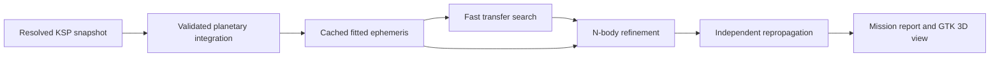

# KSP mission analysis tool: implementation plan

Planning baseline: 22 September 2026. No application implementation or dependency installation is authorized by this document alone.

## Recommended product

Build an external desktop tool with a headless numerical core, a GTK 4 interface and a small optional KSP exporter. The exporter captures the system that actually loaded; it does not perform optimization in the game. This separates long searches from game frame time and lets the same computation run from a CLI for reproducible validation.

First release: import a verified system, inspect its 3D geometry, search impulsive transfers and gravity assists, refine selected candidates with n-body propagation, and save reproducible mission reports. Aim for a focused mission designer, not full GMAT feature parity. Defer finite thrust, aerobraking, spacecraft attitude, full navigation estimation, arbitrary force plugins and automatic maneuver execution.

Proposed stack: C++ numerical core and worker executable, GTK 4/gtkmm UI, GtkGLArea for a simple OpenGL scene, optional C# KSP exporter. This avoids maintaining separate production physics implementations. Confirm Ubuntu packaging, Windows packaging and a numerical-library candidate in a small spike before committing dependencies. GTK/OpenGL provides the drawing surface, not a ready-made orbital renderer. Ubuntu/Linux is the primary build and acceptance target; Windows is also required. The current development host is Windows, so native Ubuntu execution needs a separate available environment.

## Import the resolved system

Three import confidence levels:

1. Verified runtime export from the actual KSP installation and, where applicable, Principia save state. Preferred for final predictions.
2. Resolved ModuleManager cache plus versioned configs and an explicit epoch. Useful for a new-system baseline, pending runtime comparison.
3. Raw pack ZIP or GameData scan. Show a provisional preview and unsupported patches. Do not promise that a partial standalone ModuleManager interpreter reproduces arbitrary mods.

The first milestone should establish a narrow adapter for the supplied JNSQ setup. General pack support comes from a common exported snapshot, not hardcoded planet names or blindly interpreting every mod. Scan archives without executing DLLs. Preserve input hashes, versions, patch conditions, runtime exporter version and force-model provenance.

Snapshot contents: stable body identity and hierarchy; gravitational parameter in m^3/s^2; radius and atmosphere boundary in metres; position/velocity at an explicit epoch; rotation and orientation; initial-state frame and handedness; relevant gravity harmonics and normalization; calendar; installed-mod conditions; resolved scale; solver and model settings. Keep initial-state epoch, game UT zero and calendar display origin distinct.

Principia requires special care: its documented fallback interprets orbital elements in Jacobi coordinates. Parent-relative two-body conversion is insufficient. Initial-state overrides, gravity changes and save evolution must be captured. A new-game config snapshot cannot establish the current state of an old Principia save. Detect absent required state and label the result accordingly. [Principia configuration](https://github.com/mockingbirdnest/Principia/wiki/Principia-configuration-files)

Treat “10x” as a named configuration whose resolved values must be inspected, not a universal multiplication. Radius, semi-major axis, gravitational parameter, rotation and calendar can scale differently. JNSQ at approximately real-world size is still a fictional system, not Earth/Mars/Venus orbital geometry. Let users map mission roles to imported bodies explicitly. See IMPORT-NOTES.md for pack-specific findings.

## Numerical pipeline

Planetary integration and fitted tabulation are complementary. Integrate the massive bodies once over a bounded mission horizon, then reuse a fitted ephemeris for thousands of candidate spacecraft paths. Prefer piecewise Chebyshev representation with position/velocity validation rather than an unrestricted global harmonic fit. Disallow silent extrapolation beyond coverage. Store solver, step size, tolerances and fit errors in the cache key and metadata. NASA SPK Type 2 provides a useful representation reference. [SPK documentation](https://naif.jpl.nasa.gov/pub/naif/toolkit_docs/C/req/spk.html)

Provide separate physics modes: imported KSP Keplerian rails for non-Principia gameplay comparison; independent Newtonian n-body prediction; and a later Principia-matched mode that passes comparison against the installed version. These must remain visibly distinct. N-body predictions do not match non-Principia KSP simply because their initial positions match.

Use a validated fixed-step symplectic method as a candidate for conservative planetary integration, with stability and step-convergence checks. Reproduce the installed method where Principia matching requires it. Principia's documented default is a symmetric multistep method with polynomial fitting; do not assume all Principia integration is symplectic. Handle close encounters and unstable custom systems explicitly. [Principia numerical settings](https://github.com/mockingbirdnest/Principia/wiki/Principia-configuration-files)

Spacecraft are massless test particles in the time-dependent planetary field. Use adaptive high-order integration, dense output and event root finding. Apply maneuvers as explicit state discontinuities; never switch the actual force model at sphere-of-influence boundaries. Investigate REBOUND IAS15 as a reference or implementation candidate, subject to license and packaging review. Avoid using WHFast as a default close-flyby propagator. [IAS15](https://rebound.hanno-rein.de/integrators/ias15/) and [WHFast](https://rebound.hanno-rein.de/ipython_examples/WHFast/)

Search in two stages: Lambert/patched-conic screening over dates, flight times and encounter geometry; then constrained n-body multiple shooting for the best diverse candidates. Cache evaluations and run independent candidates in CPU workers. Present several feasible solutions with objective values and constraint residuals. Neither optimizer convergence nor the best sampled solution proves a global optimum. ESA's multiple-assist formulations are useful references, not an assumed drop-in backend. [ESA MGA example](https://esa.github.io/kep3/notebooks/udp_mga_1dsm.html)

## Mission definition

The example is departure -> Mars capture/rendezvous -> 60-day stay -> Mars departure -> Venus flyby -> Earth return. It is not a chain of four flybys. Define departure parking altitude, arrival capture altitude, stay type, return entry/capture condition, launch window, allowed total duration, flyby altitude margin and burn constraints.

Make “60 days” explicit: Earth days means 5,184,000 SI seconds; game-calendar days use the imported day duration. A surface stay needs ascent/descent costs or a clearly displayed exclusion. Initial support uses a parking-orbit stay. Report injection, capture, departure and correction burns separately, plus arrival v-infinity/C3 where applicable. Define C3 conventions explicitly for departures and arrivals.

An unpowered flyby requires compatible incoming and outgoing asymptotic speeds in the patched-conic seed, an achievable turn angle and a safe periapsis. Refine its geometry under n-body dynamics. Powered flybys are an explicit later/optional mode with their burn charged. Reject surface/atmosphere intersection rather than merely drawing a smooth trajectory. A requested sequence may have no feasible candidate in the selected window.

## Time and 3D interface

Keep simulation time in SI seconds internally. Display either zero-based Y0, D0 or an explicit calendar origin such as YYYY, month, day. No leap days in the requested display mode. Store month lengths, day duration, year convention and epoch mapping; never assume an Earth year or silently translate KSP UT to UTC. Explain that a no-leap display calendar can drift relative to an orbital year. Import Kronometer settings when present; do not modify the game calendar as a side effect of changing display format.

UI layout: system/import status at left, 3D trajectories in the centre, mission sequence and constraints at right, time scrubber and candidate table below. Show ephemeris coverage, physics mode and validation status. Render simple spheres, orbital paths, spacecraft arcs, burn markers and encounter points. Provide barycentric and body-centred views, pan/orbit/zoom and selection. Exaggerated planet size is a labeled visual option. Use double precision in physics and camera-relative coordinates for rendering. Camera or visual sampling changes must never change a solution.

Search runs in a cancellable worker process, with progress, partial candidates and resumable checkpoints. A heavy search must leave the UI responsive. Save the mission, source snapshot identity, settings and results together.

## Delivery gates

| Milestone | Deliverable | Evidence needed to pass |
|---|---|---|
| M0: resolve inputs | Version manifest, scale interpretation, force/frame/time contract; Ubuntu and Windows GTK/library spike plan | Inspect exact release configs and identify actual KSP version; list dependencies to approve before installation |
| M1: system import | Exporter/adapter, canonical snapshot, body table, calendar conversion | Compare stock, JNSQ, Reborn scale and Principia on/off fixtures against loaded values; reject missing state, double scaling and bad frames |
| M2: planetary ephemeris | Headless integration and fitted cache | Two-body analytic comparison, closed-system conservation, step halving, off-grid fit and continuity checks, independent trajectory comparison |
| M3: spacecraft | Coast, impulse, encounter events and simple transfer | Kepler propagation, hyperbolic scattering, three-body reference, exact impulse timing, event and collision cases |
| M4: assist search | Lambert screening, flyby constraints, n-body refinement | Recover a known feasible benchmark, reject impossible geometry, repeatable seed and tighter independent repropagation |
| M5: GTK workflow | Import, 3D view, mission editor, worker progress and reports | Rendered review at normal display size; cancellation and save/reload; no UI freeze under the benchmark workload |
| M6: requested scenario | Mapped home/Mars/Venus/home mission with fixed stay, or an honest feasibility report | Separate burn accounting, constraint margins, source provenance and installed-KSP/Principia comparison |

Write observable numerical failure cases before implementation. Set absolute error budgets from mission clearance and targeting requirements after the first comparison spike. Proposed allocation: ephemeris fitting consumes at most 10% of encounter error allowance; final stricter repropagation differs by less than 10% of available constraint margin. Also set explicit absolute position/velocity/time tolerances so large margins cannot conceal poor numerical accuracy. Spacecraft energy is not generally conserved during gravity assists in moving fields.

## Performance and scope estimates

Assume dozens of massive bodies, multi-year horizons and a large screening population refined down to tens of candidates. Planet force evaluation is O(N^2); a test spacecraft is O(N) per evaluation. Start with CPU workers and ephemeris reuse. GPU work is deferred until profiling shows it pays.

Benchmark a fixed system/horizon/candidate count on the user's actual hardware. Record wall time, peak RAM, cache size, UI response, time to first feasible candidate and achieved accuracy. Seconds for local previews and minutes for broad searches are targets, not measured claims. No hardware inventory or performance experiment was run during planning.

A credible estimate of the full application needs M0/M1 evidence. Plan one bounded milestone at a time; do not prelaunch an agent fleet or promise a complete GMAT-class tool in a single session. The cheapest path is import correctness -> headless physics -> one validated transfer -> gravity assist -> UI and full scenario.

## Evidence boundaries

The workspace initially contained only .git and no commits. Drive metadata identifies KSP.zip (2,779,239,024 bytes) and principia lévy for 1.12.5.zip (184,863,361 bytes); archive contents and actual game version have not been inspected. Runtime compatibility and numerical performance remain untested. No full game/mod archives have been downloaded or installed.

Supplied inputs: [KSP archive](https://drive.google.com/file/d/12Y0YBMqkm1z5irQP0ns5PL8WBRRyxuoO/view), [Principia archive](https://drive.google.com/file/d/1E-zVQzDewvAxcq4Zkg85Eug0MkEVG2lU/view), [JNSQ 0.10.2](https://github.com/Galileo88/JNSQ/releases/tag/0.10.2), [Kopernicus release 247](https://github.com/Kopernicus/Kopernicus/releases/tag/release-247), [ModuleManager 4.2.3](https://ksp.sarbian.com/jenkins/job/ModuleManager/163/artifact/ModuleManager.4.2.3.dll), [Reborn v1.0.1](https://github.com/rbeap/JNSQ-Reborn/releases/tag/v1.0.1), [Kronometer](https://github.com/Kopernicus/Kronometer).

UI reference: [GTK GLArea](https://docs.gtk.org/gtk4/class.GLArea.html). Independent validation/product reference: [GMAT R2025a](https://gmat.atlassian.net/wiki/spaces/GW/blog/2962227204/Announcing%2BGMAT%2BR2025a%2BRelease). GMAT comparison requires matched states, units, times and forces; it does not automatically validate KSP compatibility.
